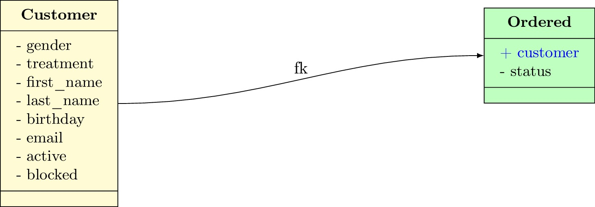
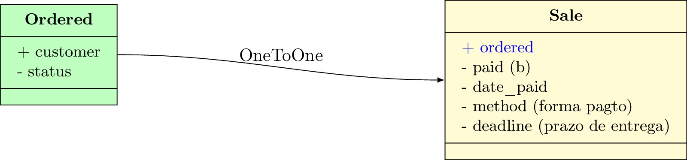
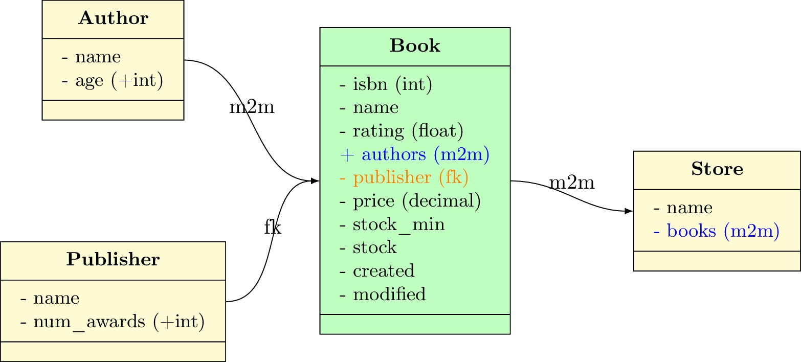
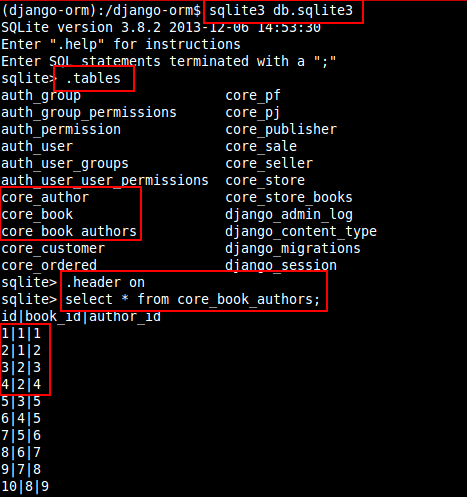
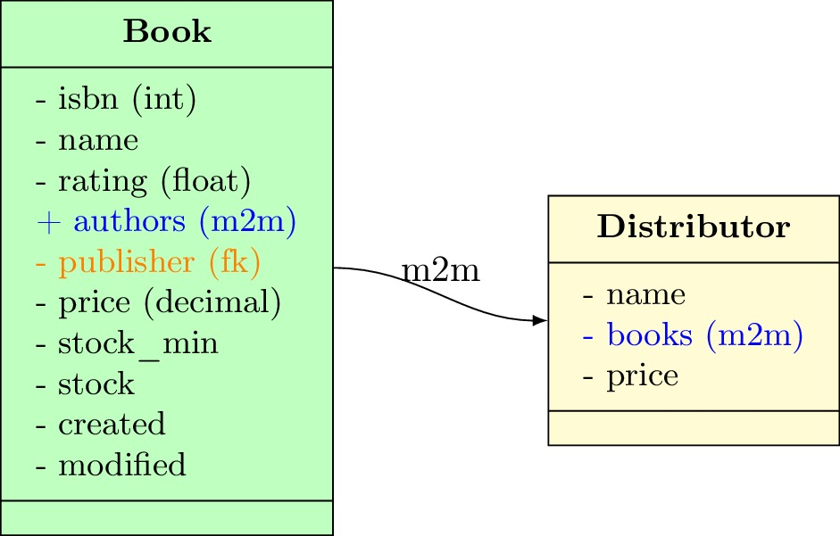
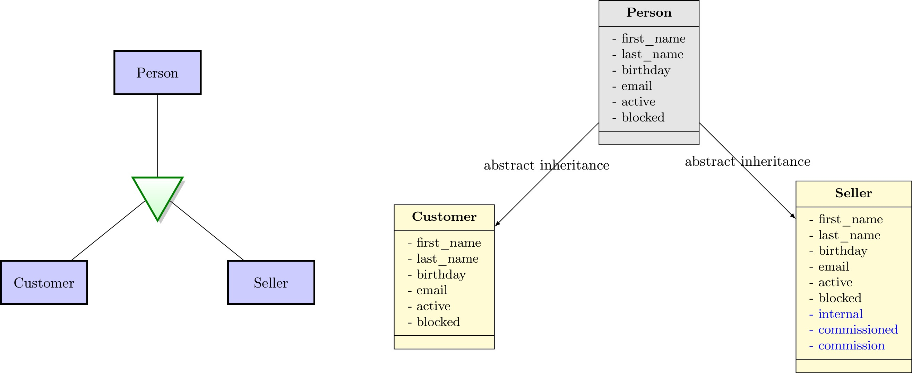
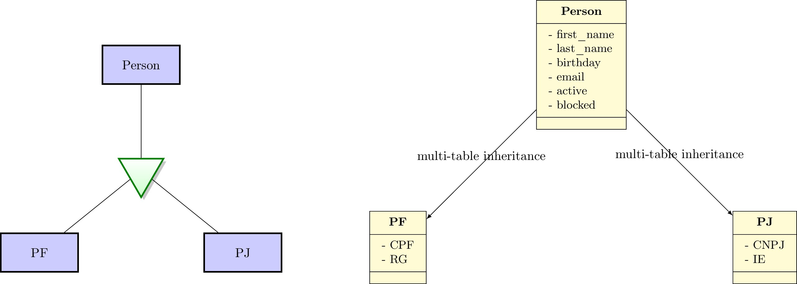
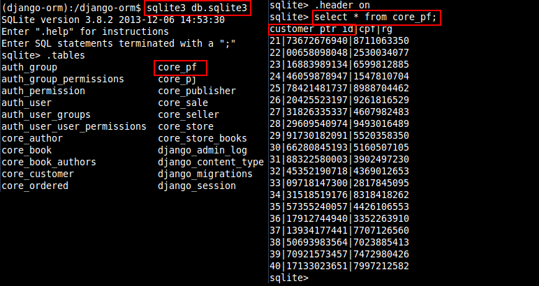
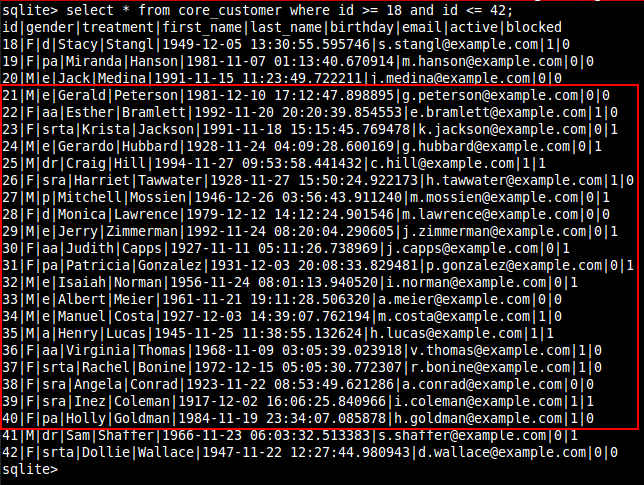

# Django ORM and Fixtures

Tutorial de Django para o [Grupy-SP][0] realizado dia 24/10/15.

**Tema**: Modelagem de banco de dados de uma **livraria**.

### Começando

	$ git clone https://github.com/rg3915/django-orm.git
	$ virtualenv -p python3 django-orm
	$ cd django-orm
	$ source bin/activate
	$ make initial
	$ make fixtures
	$ ./manage.py runserver

## Ementa

* Modelagem
	* OneToMany
	* OneToOne
	* ManyToMany
	* Abstract Inheritance
	* Multi-table Inheritance
* Fixtures
	* random values
	* csv
	* shell do Django
* Conclusão

## Objetivo

* Criar vários modelos de dados
* Popular o banco de dados

# Modelagem

## OneToMany (um para muitos)

É o relacionamento onde usamos **chave estrangeira**, conhecido como **ForeignKey**.

Um **cliente** pode fazer vários **pedidos**, então para reproduzir o esquema acima, usamos o seguinte código:

<pre>
	class Customer(models.Model):
	    gender = models.CharField(_(u'gênero'), max_length=1, choices=gender_list)
	    treatment = models.CharField(
	        _('tratamento'), max_length=4, choices=treatment_list, blank=True)
	    first_name = models.CharField(_('nome'), max_length=30)
	    last_name = models.CharField(_('sobrenome'), max_length=30)
	    birthday = models.DateTimeField(_('nascimento'), null=True, blank=True)
	    email = models.EmailField(_('e-mail'), blank=True)
	    active = models.BooleanField(_('ativo'), default=True)
	    blocked = models.BooleanField(_('bloqueado'), default=False)

	class Ordered(TimeStampedModel):
	    customer = models.<b>ForeignKey</b>(
	        'Customer', verbose_name=_('cliente'), related_name='cliente_pedido')
	    status = models.CharField(
	        _('status'), max_length=2, choices=status_list, default='pe')
</pre>

## OneToOne (um para um)

Neste tipo de relacionamento também usamos **chave estrangeira**, só que um registro de uma tabela se relaciona apenas com um registro da outra tabela.

Uma **venda** pode ser feita a partir de apenas um **pedido**, então para reproduzir o esquema acima, usamos o seguinte código:

<pre>
	class Ordered(TimeStampedModel):
	    customer = models.ForeignKey(
	        'Customer', verbose_name=_('cliente'), related_name='cliente_pedido')
	    status = models.CharField(
	        _('status'), max_length=2, choices=status_list, default='pe')

	class Sale(models.Model):
	    ordered = models.<b>OneToOneField</b>('Ordered', verbose_name=_('pedido'))
	    paid = models.BooleanField(_('pago'), default=False)
	    date_paid = models.DateTimeField(_('pago em'), null=True, blank=True)
	    method = models.CharField(_('forma de pagto'), max_length=20, blank=True)
	    deadline = models.CharField(
	        _('prazo de entrega'), max_length=50, blank=True)
</pre>

## ManyToMany (muitos para muitos)

Este relacionamento permite que vários registros de uma tabela se relacione com vários registros da outra tabela.

Um **autor** pode ter vários **livros** e cada **livro** pode ter vários **autores**, então para reproduzir o esquema acima, usamos o seguinte código:

<pre>
	class Author(models.Model):
	    name = models.CharField(_('nome'), max_length=50, unique=True)
	    age = models.PositiveIntegerField(_('idade'))

	class Book(TimeStampedModel):
	    isbn = models.IntegerField()
	    name = models.CharField(_('nome'), max_length=50)
	    rating = models.FloatField(_(u'classificação'))
	    authors = models.<b>ManyToManyField</b>('Author', verbose_name='autores')
	    publisher = models.ForeignKey('Publisher', verbose_name='editora')
	    price = models.DecimalField(_(u'preço'), max_digits=5, decimal_places=2)
	    stock_min = models.PositiveIntegerField(_(u'Estoque mínimo'), default=0)
	    stock = models.IntegerField(_('Estoque atual'))
</pre>

E o mesmo para **lojas**.

<pre>
	class Store(models.Model):
	    name = models.CharField(_('nome'), max_length=50)
	    books = models.<b>ManyToManyField</b>('Book', verbose_name='livros')
</pre>

Por baixo dos panos o Django cria uma terceira tabela (escondida).

	
Neste caso, temos dois livros com dois autores cada.

	id|book_id|author_id
	1|1|1
	2|1|2
	3|2|3
	4|2|4

E ainda, na sequência temos dois livros diferentes do mesmo autor.

	id|book_id|author_id
	5|3|5
	6|4|5

### Mais um exemplo

Um outro exemplo legal é o caso onde vários **livros** podem ser entregues por vários **fornecedores**.

## Abstract Inheritance (Herança Abstrata)

Neste tipo de modelo o Django cria novas tabelas a partir de uma tabela abstrata (base).

As novas tabelas são uma **cópia** da primeira.

Não existe relacionamento entre elas. Mas campos adicionais podem ser criados nas novas tabelas.

<pre>
	class Person(models.Model):
	    gender = models.CharField(_(u'gênero'), max_length=1, choices=gender_list)
	    treatment = models.CharField(
	        _('tratamento'), max_length=4, choices=treatment_list, blank=True)
	    first_name = models.CharField(_('nome'), max_length=30)
	    last_name = models.CharField(_('sobrenome'), max_length=30)
	    birthday = models.DateTimeField(_('nascimento'), null=True, blank=True)
	    email = models.EmailField(_('e-mail'), blank=True)
	    active = models.BooleanField(_('ativo'), default=True)
	    blocked = models.BooleanField(_('bloqueado'), default=False)

    class Meta:
        <b>abstract = True</b>

	class Customer(Person):
	    pass

	class Seller(Person):
	    internal = models.BooleanField(_('interno'), default=True)
	    commissioned = models.BooleanField(_('comissionado'), default=True)
	    commission = models.DecimalField(
	        _(u'comissão'), max_digits=6, decimal_places=2, default=0.01, blank=True)
</pre>

Note que a tabela **Customer** é uma cópia de **Person**, e **Seller** também é uma cópia, mas com campos adicionais.

## Multi-table Inheritance (Herança Multi-tabela)

Na herança múltipla o Django cria um relacionamento **um pra um (OneToOne)** automaticamente entre as tabelas.

Entrando no banco de dados vemos que a tabela `core_pf` possui um campo chamado `customer_ptr_id`....

... e que os ids vão de 21 a 40, neste exemplo.

Note que são os mesmos ids na tabela `customer`.

E se você digitar...

	sqlite> .schema core_pf
	CREATE TABLE "core_pf" ("customer_ptr_id" integer NOT NULL PRIMARY KEY REFERENCES 
	"core_customer" ("id"), "cpf" varchar(11) NOT NULL, "rg" varchar(10) NOT NULL);

... você verá nitidamente que existe um relacionamento um pra um entre eles.

# Fixtures

Vamos criar nossas próprias fixtures usando Python, csv e shell do Django.

## random values

Vamos precisar do [rstr][1].

	$ pip install rstr
	$ python
	>>> import rstr
	>>> rstr.rstr('abcde',10)
	'ddcbeedacb'

Apenas uma amostra do poder do Python.

	# gen_random_values.py
	import random
	import rstr
	import datetime
	from decimal import Decimal

	def gen_age(min_age=15, max_age=99):
	    # gera numeros inteiros entre 15 e 99
	    return random.randint(min_age, max_age)

	def gen_doc(doc='cpf'):
	    if doc == 'cpf':
	        return rstr.rstr('1234567890', 11)
	    elif doc == 'cnpj':
	        return rstr.rstr('1234567890', 14)
	    elif doc == 'rg':
	        return rstr.rstr('1234567890', 10)

	def gen_phone():
	    # gera um telefone no formato (xx) xxxx-xxxx
	    return '({0}) {1}-{2}'.format(
	        rstr.rstr('1234567890', 2),
	        rstr.rstr('1234567890', 4),
	        rstr.rstr('1234567890', 4))

	def gen_timestamp(min_year=1915, max_year=1996):
	    # gera um datetime no formato yyyy-mm-dd hh:mm:ss.000000
	    year = random.randint(min_year, max_year)
	    month = random.randint(11, 12)
	    day = random.randint(1, 28)
	    hour = random.randint(1, 23)
	    minute = random.randint(1, 59)
	    second = random.randint(1, 59)
	    microsecond = random.randint(1, 999999)
	    date = datetime.datetime(
	        year, month, day, hour, minute, second, microsecond).isoformat(" ")
	    return date

	def gen_decimal(max_digits, decimal_places):
	    num_as_str = lambda x: ''.join(
	        [str(random.randint(0, 9)) for i in range(x)])
	    return Decimal("%s.%s" % (num_as_str(max_digits - decimal_places),
	                              num_as_str(decimal_places)))
	gen_decimal.required = ['max_digits', 'decimal_places']

Agora vamos precisar do [names][2].

	$ pip install names
	$ python
	>>> import names
	>>> names.get_first_name(gender='male')
	'Jean'
	>>> names.get_first_name(gender='female')
	'Emily'
	>>> names.get_last_name()
	'Oconnor'

E vejamos como gerar nomes aleatórios.

	# gen_names.py
	import random
	import names

	""" List of values for use in choices in models. """
	treatment_male_list = ('a','dr','e','p','sr',)

	treatment_female_list = ('aa','d','ea','pa','sra','srta',)

	def gen_male_first_name():
	    treatment = random.choice(treatment_male_list)
	    first_name = names.get_first_name(gender='male')
	    c = {'treatment': treatment, 'first_name': first_name}
	    return c

	def gen_female_first_name():
	    treatment = random.choice(treatment_female_list)
	    first_name = names.get_first_name(gender='female')
	    c = {'treatment': treatment, 'first_name': first_name}
	    return c

	def gen_last_name():
	    return names.get_last_name()

## csv

Para ler um `csv` façamos o seguinte:

	import csv

	book_list = []

	''' Lendo os dados de books_.csv '''
	with open('fixtures/csv/books_.csv', 'r') as f:
	    r = csv.DictReader(f)
	    for dct in r:
	        book_list.append(dct)
	    f.close()

Com isso nós temos uma **lista** onde os valores são **dicionários**.

	[{'name': 'O diário de Anne Frank', 'publisher': 'Record', 'authors': 'Mirjam Pressler'},
	 {'name': 'O diário de Anne Frank', 'publisher': 'Record', 'authors': 'Otto H. Frank'},
	 {'name': 'Deixados Para Trás', 'publisher': 'United Press', 'authors': 'Jerry B. Jenkins'},
	 {'name': 'Deixados Para Trás', 'publisher': 'United Press', 'authors': 'Tim LaHaye'},
	 {'name': 'Jardim secreto', 'publisher': 'Sextante', 'authors': 'Johanna Basford'},
	 {'name': 'Floresta encantada', 'publisher': 'Sextante', 'authors': 'Johanna Basford'},
	 ...
	]

## shell do Django

	$ python manage.py shell

O que você precisa saber?

	from core.models import Book, Author, Publisher

	''' Criando uma instância do objeto Publisher '''
	publisher_obj = Publisher(name='Editora 34',num_awards=8)

	''' Salvando o objeto '''
	publisher_obj.save()

	''' Criando um Author direto com o comando create '''
	Author.objects.create(name='Dante Alighieri',age=56)

	''' Pegando o id de Author '''
	author = Author.objects.get(name='Dante Alighieri')

	''' Pegando o id de Publisher '''
	publisher = Publisher.objects.get(pk=publisher_obj.id)

	''' Criando um livro '''
	book_obj = Book(
	    name='A Divina Comédia',
	    publisher=publisher,
	    price=29.20,
	)
	book_obj.save()

	''' Inserindo os autores nos livros '''
	book = Book.objects.get(pk=book_obj.id)

	''' Como o campo authors é ManyToMany devemos usar o comando add '''
	book.authors.add(author)

Você pode salvar um arquivo `shell_book.py` e digitar

	$ ./manage.py shell < fixtures/shell_book.py

## Conclusão

### Vantagens

* Criando o seu próprio código você sabe o que está fazendo
* Você vai treinar muito Python
* Vai aprender a usar o shell do Django
* Fácil de inserir seus próprios dados

### Desvantagens

* Pode demorar um pouco para criar o código
* Difícil manutenção
* Se fizer uma migração no banco terá que refatorar o código

### Conclusão

* Ninguém recomenda
* Recomendam o [mixer][3] ou [model-mommy][4]
* Mas para inserir seus próprios dados é uma boa solução

Leia o `Makefile` para ver como foi executado cada comando.

Veja a pasta `fixtures` para ver os códigos Python que geram os valores.

Obrigado!

Tutorial de Django para o [Grupy-SP](https://github.com/grupy-sp/encontros) realizado dia 24/10/15.

[0]: https://github.com/grupy-sp/encontros
[1]: https://pypi.python.org/pypi/rstr/2.1.3
[2]: https://pypi.python.org/pypi/names/
[3]: http://mixer.readthedocs.org/en/latest/index.html
[4]: https://github.com/vandersonmota/model_mommy